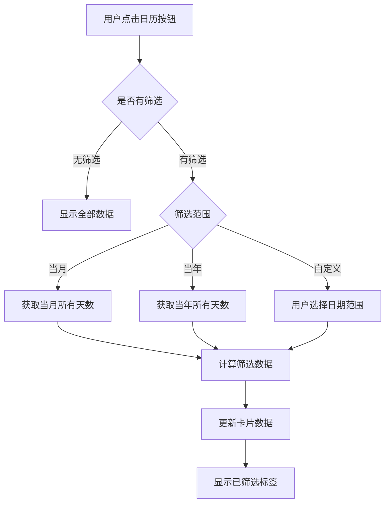
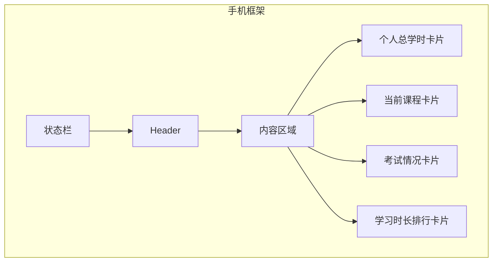

# personalStudy
学习情况原型

## 学习数据中心展示页面
### Running the code

Run `npm i` to install the dependencies.

Run `npm run dev` to start the development server.

## 需求重提

### 功能介绍

本原型是一个学习培训助手移动端个人学习数据展示页面
模拟手机屏幕尺寸，展示用户的学习情况。

### 功能模块

#### 1. 个人总学时卡片

- 展示用户在该时间段内的学习总时长（小时为单位）
- 顶部右侧有日历筛选按钮，点击展开内嵌日历
- 日历支持：
  - 点击选择开始日期和结束日期
  - 点击顶部年月可选择"筛选当月"或"筛选当年"
  - 月份切换（左右箭头）
  - 选中日期范围后显示"已筛选"标签
  - 提供"清除筛选"按钮恢复全部数据
- 日历下方展示课程分布进度条

#### 2. 当前课程卡片

- 显示当前正在学习的课程名称
- 右侧"继续学习"按钮（蓝色文字 + > 箭头样式）
- 下方显示学习进度条

#### 3. 考试情况卡片

- 显示考试总数、及格/不及格数量和通过率
- 环形图展示通过率
- 点击"查看更多"展开考试历史详情

#### 4. 学习时长排行卡片

- 展示课程学习时长排行榜（TOP5）
- 每行显示课程名称和进度条

### 数据筛选逻辑

### 页面结构

### 数据响应逻辑

当用户进行日期筛选后，下方各个卡片数据会根据筛选的时间范围进行动态更新：

| 卡片 | 筛选后行为 |
|------|-----------|
| 个人总学时 | 按筛选天数占当月比例重新计算 |
| 课程分布 | 重新计算各课程百分比 |
| 考试情况 | 筛选并重新统计及格/不及格数量 |
| 学习时长排行 | 按比例缩减各课程时长显示 |

---

